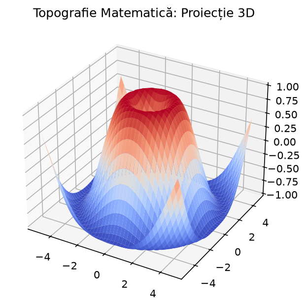
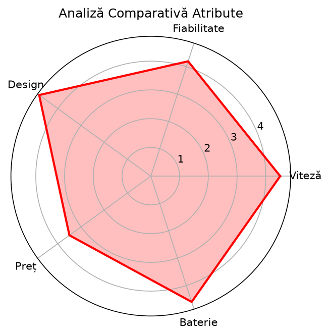

# 📊 Portofoliu de Studiu Aprofundat: Vizualizare Date și Algoritmică

Proiect dedicat ingineriei datelor, complet optimizat conform standardelor profesionale **PEP 8** folosind asistentul **Ruff** (0 Errors / 0 Problems). 

---

## 🎨 Galeria de Impact Vizual (Randări din Proiect)

### 📈 1. Relief Topografic Continuu (Suprafață 3D Wave)

### 🕸️ 2. Amprenta Atributelor de Performanță (Radar Spider Chart)

---

## 🧰 Tehnologii și Instrumente Utilizate
* **Core Analytics**: Pandas, NumPy, Scikit-Learn (Linear Regression, Decision Trees)
* **Vizualizare Statică & Interactivă**: Matplotlib, Seaborn, Plotly Express
* **Data Apps**: Streamlit UI, Managementul Stării (`st.session_state`), SQLite3 Nativ
* **Modern Tooling**: Astral UV (Environment Management), Ruff (Linting & Formatting)
